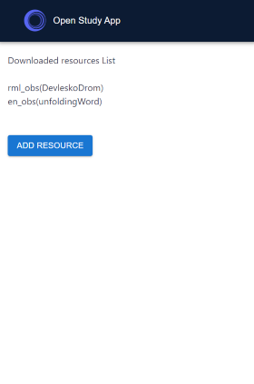
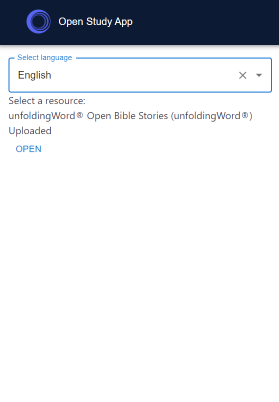
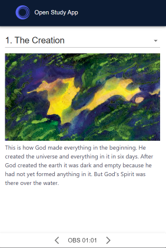

# ObsStudyApps

<div id="top"></div>
<!--
*** Thanks for checking out the Best-README-Template. If you have a suggestion
*** that would make this better, please fork the repo and create a pull request
*** or simply open an issue with the tag "enhancement".
*** Don't forget to give the project a star!
*** Thanks again! Now go create something AMAZING! :D
-->

<!-- PROJECT SHIELDS -->
<!--
*** I'm using markdown "reference style" links for readability.
*** Reference links are enclosed in brackets [ ] instead of parentheses ( ).
*** See the bottom of this document for the declaration of the reference variables
*** for contributors-url, forks-url, etc. This is an optional, concise syntax you may use.
*** https://www.markdownguide.org/basic-syntax/#reference-style-links
-->

[![Contributors][contributors-shield]][contributors-url]
[![Forks][forks-shield]][forks-url]
[![Stargazers][stars-shield]][stars-url]
[![Issues][issues-shield]][issues-url]
[![MIT License][license-shield]][license-url]

<!-- PROJECT LOGO -->
<br />
<div align="center">
  <a href="https://github.com/micro-librarians/obs-study-apps">
    
  </a>

<h3 align="center">OBS Study Apps</h3>

  <p align="center">
    Application to view Open Bible Stories and Study Notes. 
    <br />
    <a href="https://github.com/micro-librarians/obs-study-apps"><strong>Explore the docs »</strong></a>
    <br />
    <br />
    <a href="https://obs-study.netlify.app/">View Demo</a>
    ·
    <a href="https://github.com/micro-librarians/obs-study-apps/issues">Report Bug</a>
    ·
    <a href="https://github.com/micro-librarians/obs-study-apps/issues">Request Feature</a>
  </p>
</div>

<!-- TABLE OF CONTENTS -->
<details>
  <summary>Table of Contents</summary>
  <ol>
    <li>
      <a href="#about-the-project">About The Project</a>
      <ul>
        <li><a href="#built-with">Built With</a></li>
      </ul>
    </li>
    <li>
      <a href="#getting-started">Getting Started</a>
      <ul>
        <li><a href="#prerequisites">Prerequisites</a></li>
        <li><a href="#installation">Installation</a></li>
      </ul>
    </li>
    <li><a href="#usage">Usage</a></li>
    <li><a href="#roadmap">Roadmap</a></li>
    <li><a href="#contributing">Contributing</a></li>
    <li><a href="#license">License</a></li>
    <li><a href="#contact">Contact</a></li>
    <li><a href="#acknowledgments">Acknowledgments</a></li>
  </ol>
</details>

<!-- ABOUT THE PROJECT -->

## About The Project

### Background

**Purpose**

- This purpose of this project was to create a way to view Open Bible Stories offline

**Problem**

- When sharing Open Bible Stories on the field, there is not always access to internet. There needs to be an easy way to download Open Bible stories to access them without internet

**Scope**

- The scope of this project is displaying Open Bible Stories and other study resources around it (Bible text, study notes, discipleship resources) that would be beneficially to download and have offline

**Background**

- We explored two avenues of making these resources available offline: Progressive Web Apps (PWAs) and Electron.
  - Our main implementation is a PWA, as resources are saved to a user's cache. The application can be downloaded onto a user's device after they first visit the website and load resources.
  - We are working towards also giving the option to export this project into an Electron app if needed as a desktop application.

### Screenshots

**Home Page**\


**Add Resource Page**\


**OBS Story Page**\


<p align="right">(<a href="#top">back to top</a>)</p>

### Built With

- [Nx](https://nx.dev/)
- [Next.js](https://nextjs.org/)
- [React.js](https://reactjs.org/)
- [Vue.js](https://vuejs.org/)
- [Material UI](https://mui.com/)
<p align="right">(<a href="#top">back to top</a>)</p>

<!-- GETTING STARTED -->

## Getting Started

To get a local copy up and running follow these simple example steps.

### Prerequisites

**Install NX (using npm, yarn, pnpm, etc...)**

```sh
npm install nx -g
```

### Installation/First Steps

**Clone the repo**

```sh
git clone https://github.com/micro-librarians/obs-study-apps.git
```

**Install NPM packages (npm, yarn, etc...)**

```sh
npm install
```

**Run the app (npx, pnpm, yarn)**

```sh
npx nx serve obs-study
```

### Creating a New Component

**Components are created in the `libs` folder**

```sh
npx nx generate @nrwl/react:library new-component
```

### Understand this workspace

**Run `nx graph` to see a diagram of the dependencies of the projects.**

```sh
pnpm nx graph
```

### Further Nx Documentation

For further information on how to interact with this Nx monorepo, check out the [_integrateed repo documentation_](https://nx.dev/getting-started/integrated-repo-tutorial)

<p align="right">(<a href="#top">back to top</a>)</p>

<!-- USAGE EXAMPLES -->

## Usage/Integration

Use this space to show useful examples of how a project can be used. Additional screenshots, code examples and demos work well in this space. You may also link to more resources.

_For more examples, please refer to the [Documentation](https://example.com)_ Possibly JS Docs.

[Styleguidist link](https://example.netlify.app)

<p align="right">(<a href="#top">back to top</a>)</p>

<!-- ROADMAP -->

## Roadmap

- [] Add ability to read the Bible offline to the app
- [] Add discipleship resources to the app
  - [] Studying features like taking notes and highlighting text.

See the [open issues](https://github.com/micro-librarians/obs-study-apps/issues) for a full list of proposed features (and known issues).

<p align="right">(<a href="#top">back to top</a>)</p>

<!-- CONTRIBUTING -->

## Contributing

Contributions are what make the open source community such an amazing place to learn, inspire, and create. Any contributions you make are **greatly appreciated**. [Guidelines for external contributions.](https://forum.door43.org)

You can also simply open an issue with the tag "enhancement".
Don't forget to give the project a star! Thanks again!

If you would like to fork the repo and create a pull request.

1. Fork the Project
2. Create your Feature Branch (`git checkout -b feature/AmazingFeature`)
3. Commit your Changes (`git commit -m 'Add some AmazingFeature'`)
4. Push to the Branch (`git push origin feature/AmazingFeature`)
5. Open a Pull Request

<p align="right">(<a href="#top">back to top</a>)</p>

<!-- LICENSE -->

## License

Distributed under the MIT License. See `LICENSE` for more information.

<p align="right">(<a href="#top">back to top</a>)</p>

<!-- CONTACT -->

## Contact

Project Link: [https://github.com/micro-librarians/obs-study-apps](https://github.com/micro-librarians/obs-study-apps)

<p align="right">(<a href="#top">back to top</a>)</p>

<!-- MARKDOWN LINKS & IMAGES -->
<!-- https://www.markdownguide.org/basic-syntax/#reference-style-links -->

[contributors-shield]: https://img.shields.io/github/contributors/micro-librarians/obs-study-apps.svg?style=for-the-badge
[contributors-url]: https://github.com/micro-librarians/obs-study-apps/graphs/contributors
[forks-shield]: https://img.shields.io/github/forks/micro-librarians/obs-study-apps.svg?style=for-the-badge
[forks-url]: https://github.com/micro-librarians/obs-study-apps/network/members
[stars-shield]: https://img.shields.io/github/stars/micro-librarians/obs-study-apps.svg?style=for-the-badge
[stars-url]: https://github.com/micro-librarians/obs-study-apps/stargazers
[issues-shield]: https://img.shields.io/github/issues/micro-librarians/obs-study-apps.svg?style=for-the-badge
[issues-url]: https://github.com/micro-librarians/obs-study-apps/issues
[license-shield]: https://img.shields.io/github/license/micro-librarians/obs-study-apps.svg?style=for-the-badge
[license-url]: https://github.com/micro-librarians/obs-study-apps/blob/master/LICENSE.txt
